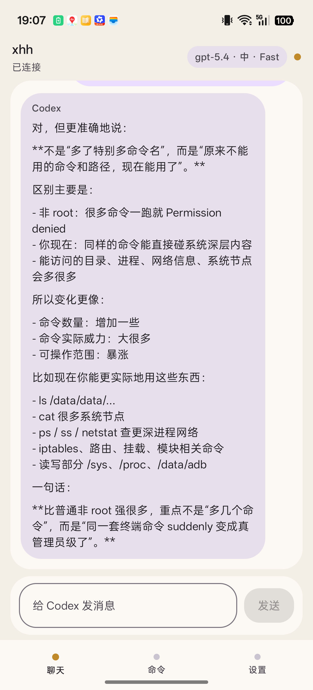
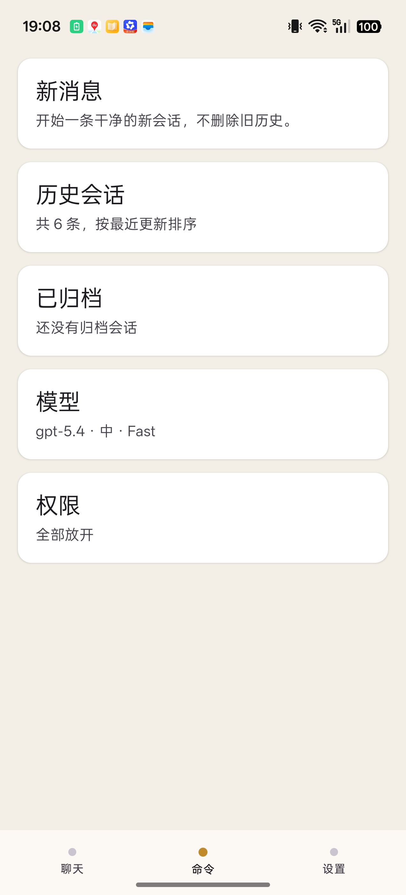

# Codex Mobile

Codex Mobile 是一个 Android 应用，目标是把运行在 Termux 里的本地 Codex 后端，做成一个更像产品而不是终端工具的手机端体验。

当前界面以中文为主，这是因为项目本来就是在真实手机环境里持续打磨的。以后可以继续补英文或多语言，但这不影响项目本身开源。

## 截图

| 聊天页 | 命令页 |
| --- | --- |
|  |  |

## 这个项目是什么

- 基于 Jetpack Compose 的 Android App
- 后端运行在 Termux 里的社区版 Codex CLI
- Termux 只做运行时底座，不再作为主要交互界面
- 重点放在聊天体验、线程恢复、移动端交互和产品化外壳

## 当前已经做到的能力

- 自动拉起并连接本地 Codex 后端
- 在手机上继续真实 Codex 线程
- 历史会话、归档、恢复、删除流程
- 模型切换、智力档位切换、权限模式和 Fast 模式
- 对长对话和移动端不稳定场景做了恢复和桥接优化

## 为什么要做这个项目

Codex 的终端工作流很强，但它并不是一个适合手机触摸使用的产品。

这个项目想解决的是：

- 手机上直接打开 App，而不是长期停留在终端里
- 对话、线程和历史在触摸屏上可读、可点、可恢复
- 接的是真正的本地 Codex 后端，而不是一个假的聊天壳
- 把模型、智力、权限、线程等能力收成更像产品的交互

## 技术架构

- UI：Jetpack Compose
- 后端运行时：Termux 中的社区版 Codex CLI
- Bridge：App 与本地后端之间的 RPC 桥接
- 运行时辅助：基于 root 的后端生命周期和恢复逻辑

## 当前交互方向

Codex Mobile 现在的方向不是“把终端套个皮”，而是尽量往“Android 上接近桌面版体验的 Codex 外壳”去做：

- 聊天优先
- 线程管理适合手机操作
- 本地后端生命周期由 App 接管
- 后台恢复、重连、状态同步更产品化
- 尽量不把原始终端 UX 直接暴露给用户

## 当前阶段

这个项目目前还处在活跃迭代中，目标是把它打磨成“Android 上接近桌面版体验的 Codex 外壳”。

当前重点：

- 桥接和状态机稳定性
- 长线程恢复
- 聊天页交互打磨
- 图片输入支持

## 运行预期

这个仓库公开的是 App 工程本身，不是一份“一键还原某台手机”的整机镜像。

如果你要自己运行或二次开发，需要自己准备：

1. Android Studio 和 Android SDK
2. 手机上的 Termux
3. Termux 里的 Codex 后端包
4. 本地认证
5. 你的代理与 root 环境配置

这个项目当前默认面向 rooted Android 场景，因为后端生命周期、恢复和更深的系统桥接本来就是产品设计的一部分。

## 当前限制

- UI 目前仍以中文为主
- 后端行为会受到社区版 Termux Codex 包版本影响
- Android 与 root 相关配置仍然是运行时的一部分
- 图片输入能力已经在后端探通，但前端 UI 还没接上
- 长线程和重连稳定性还在持续加固中

## 仓库包含与不包含

这个仓库只公开 App 工程本身，不公开设备私有运行环境。

仓库里不包含：

- Termux 登录态和认证文件
- 本地 Codex 会话历史
- 运行环境备份压缩包
- 设备专用代理或 root 配置
- 私有调试产物

## 开源定位

这个仓库是为了公开项目代码，不是为了完整导出某一台手机上的全部运行环境。

如果你要自行运行或二次开发，仍需要自己准备：

- Android 构建环境
- Termux 运行时
- Codex 后端包
- 本地认证和代理配置

## 许可证

本项目使用 [MIT License](LICENSE)。
